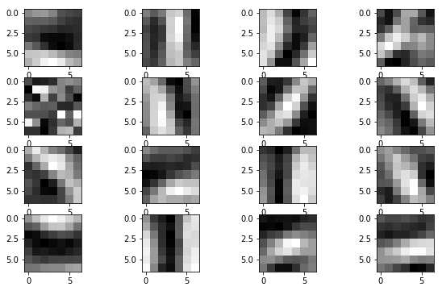

# Convolutional Neural Network(CNN) in Numpy

> Wenlong "Waylon" Wu, University of Missouri

### Introduction

This project is a **Numpy** implementation of Convolutional Neural Network (CNN) and Multi-Layer Perceptron (MLP) algorithms on the MNIST dataset. It performs **exact same** as the Tensor Flow version. 

The final kernel visualization is shown in below:

Check out the attached report pdf for more information.

Jupyter Notebook codes:
- Part 2.ipynb: MLP codes
- Part 3&4-conv-10.ipynb: structure 1 (conv-10) codes
- Part 3&4-conv-128-10.ipynb: structure 2 (conv-128-10) codes
- Part 3&4-mnist.ipynb:  structure 1 (conv-10) codes on MNIST benchmark
- tf-mnist.ipynb: verification of Part 3&4-mnist.ipynb using Keras, the result is correct:)